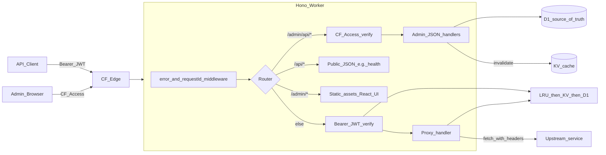

# Cursor build prompt: Proxify CF Worker

Paste this entire document into a Cursor chat to scaffold and implement the project in one pass. Follow sections in order; do not re-litigate decisions marked **Locked**.

---

## Goal

Build a **predictable, maintainable Cloudflare Worker API** that:

1. **Reverse-proxies** incoming requests to configured upstream URLs (not redirects): fetch upstream, inject custom request headers, stream the response back.
2. **Authorizes** API traffic with **Bearer JWT** verified asymmetrically (`RS256` or `ES256`; prefer **ES256** on Workers — smaller keys, Web Crypto friendly).
3. **Routes by Host**: map `Host` header → upstream URL + optional templated headers + behavior flags.
4. Makes **token configuration** and **host/route mapping** **dynamic** via **D1** (source of truth) + **Workers KV** (read-through cache for hot paths).
5. Ships an **Admin UI** (React + Vite, static assets) behind **Cloudflare Access** (Zero Trust); do **not** implement a separate username/password system.

---

## Locked decisions

| Topic | Choice | Rationale |
|--------|--------|-----------|
| Edge framework | **Hono** | Middleware chain fits auth → proxy; small surface on Workers. |
| JWT library | **jose** | ES256/RS256, JWK import, claim validation; Web Crypto on Workers. |
| Primary store | **D1** | Relational data: clients, keys, routes, **M:N grants**, audit, issued-token revocation. |
| Cache layer | **KV** + **in-memory LRU** | KV: `key:{kid}`, `route:{host}` with TTL ~60s + **explicit invalidation** on admin writes; LRU per isolate for burst reads. |
| Admin auth | **Cloudflare Access** | Verify `Cf-Access-Jwt-Assertion` against Cloudflare JWKS; trust `email` as actor for audit. |
| Token modes | **Both** per key | `client_signed`: private key shown **once** (download), never stored. `server_issued`: encrypt private signing material at rest (AES-GCM with env KEK); mint JWTs with `jti` for revocation. |
| Local admin bypass | **`LOCAL_ADMIN_EMAIL`** | Dev only: treat requests as that email when Access headers absent (document clearly). |

---

## Architecture



**Request path (API clients)**

1. Extract `Authorization: Bearer <jwt>`.
2. Decode JWT header → `kid`, `alg`.
3. Resolve public key + client metadata: LRU → KV `key:{kid}` → D1 `keys` join `clients` on miss; populate KV.
4. `jwtVerify` with `jose`; enforce `exp`, optional `iss`/`aud` per key config.
5. If mode `server_issued`: check `jti` not in `issued_tokens.revoked` / expired.
6. Match route by `Host` (and optionally path prefix if you add it): KV `route:{host}` → D1 on miss.
7. Verify **grant**: `(client_id, route_id)` exists in `client_route_grants`.
8. Build upstream URL (preserve path/query/method per route config), strip hop-by-hop headers, add templated custom headers, `fetch`, stream response.

**Admin path**

- Browser hits `/admin/*` — Access policy required at zone/app level.
- Worker verifies Access JWT for `/admin/api/*`; use `email` as `actor` in audit log.
- **`GET /api/health`** (under **`/api/*`**) returns JSON liveness (D1 + KV); no Access required. **`/health`** in the SPA is the human-readable status page.

---

## Repository layout (monorepo)

```
proxify-cf/
  apps/
    worker/
      src/
        index.ts                 # Hono app, route mounting
        env.ts                   # Typed Bindings: DB, CACHE, secrets
        middleware/
          auth.ts                # Bearer JWT → ctx.set('auth', ...)
          cf-access.ts           # Verify Cf-Access-Jwt-Assertion (prod); LOCAL_ADMIN_EMAIL (dev)
          audit.ts               # Append audit_log rows
          error.ts
          request-id.ts
        proxy/
          handler.ts             # Host → route → grants → fetch + stream
          headers.ts             # Hop-by-hop strip; templating
          stream.ts              # ReadableStream passthrough
        api/
          routes.ts              # Mount public /api/* (e.g. /api/health)
        admin/
          routes.ts              # Mount /admin/api/v1/*
          clients.ts
          keys.ts                # Generate, rotate, revoke
          routes-handler.ts      # CRUD routes + headers + grants
          tokens.ts              # Mint / revoke server-issued
        repo/*.ts                # Thin D1 queries (or single db module)
        lib/
          jwt.ts                 # jose wrappers
          crypto.ts              # AES-GCM for server_issued key encryption
          template.ts            # Header value placeholders
          cache.ts               # KV get/set/invalidate + LRU
          logger.ts
        types.ts
      migrations/0001_init.sql
      wrangler.jsonc
      test/*.spec.ts             # Vitest + Miniflare or wrangler test
    admin/
      src/
        main.tsx
        App.tsx
        lib/api.ts               # fetch /admin/api/v1
        pages/                   # Clients, Keys, Routes, Grants, Tokens, Audit
        components/
      vite.config.ts             # proxy /admin/api/v1 and /api → worker in dev
  packages/shared/
    src/schemas.ts               # Zod schemas shared worker + admin
    src/types.ts
  scripts/
    setup.ts                     # D1 migrate + seed
    gen-token.ts                 # CLI: mint test JWT for curl
  pnpm-workspace.yaml
  package.json
  tsconfig.base.json
  README.md
```

---

## D1 schema (initial migration)

- **`clients`**: `id` (text ULID), `name`, `email`, `description`, `created_at`, `created_by`, `disabled_at`
- **`keys`**: `kid` (PK), `client_id` FK, `alg`, `mode` (`client_signed` | `server_issued`), `public_jwk` (JSON text), `private_jwk_encrypted` (nullable — only `server_issued`), `created_at`, `expires_at`, `rotated_to_kid`, `revoked_at`
- **`routes`**: `id`, `host` (unique), `upstream_url`, `preserve_path`, `preserve_query`, `preserve_method`, `forward_body`, `timeout_ms`, `created_at`, `disabled_at`
- **`route_headers`**: `route_id`, `header_name`, `header_value` (templated strings)
- **`client_route_grants`**: `client_id`, `route_id`, `granted_at`, `granted_by` — **M:N** mapping
- **`issued_tokens`**: `jti` PK, `kid`, `client_id`, `issued_at`, `expires_at`, `revoked_at`, `label` (optional)
- **`audit_log`**: `id`, `ts`, `actor`, `action`, `target`, `meta` (JSON)

Indexes: `keys(client_id)`, `keys(revoked_at)`, `issued_tokens(client_id)`, `client_route_grants(client_id)`, `client_route_grants(route_id)`.

---

## KV keys and invalidation

| Key pattern | Value | Notes |
|-------------|--------|--------|
| `key:{kid}` | Serialized public JWK + client id + mode + constraints | Invalidate on key create/rotate/revoke |
| `route:{host}` | Route id + upstream + flags + header list | Invalidate on route or header change |

Admin writes that touch keys, routes, headers, or grants **must** delete affected KV entries (or bump version key). LRU cleared on same events.

---

## Header templating

Support placeholders in `route_headers.header_value`, expanded at proxy time:

- `{host}`, `{path}`, `{method}`
- `{client.id}`, `{client.name}`
- JWT claims as `{jwt.sub}`, `{jwt.email}` if present

Document escaping rules (no raw upstream injection from untrusted template sources).

---

## Admin API (JSON under `/admin/api/v1`)

Protected by CF Access verification middleware.

- **Clients**: CRUD
- **Keys**: generate (returns private JWK **once** for `client_signed`), rotate (link `rotated_to`), revoke
- **Routes**: CRUD + nested **headers**
- **Grants**: link client ↔ route (many-to-many)
- **Tokens** (server_issued): mint JWT (returns bearer string once), list/revoke by `jti`
- **Audit**: paginated query

---

## `wrangler.jsonc` essentials

- `[[d1_databases]]` binding `DB`
- `kv_namespaces` binding `CACHE` (or name your binding consistently)
- `[vars]` / secrets: `CF_ACCESS_TEAM_DOMAIN`, `CF_ACCESS_AUD`, KEK for AES-GCM (secret), `LOCAL_ADMIN_EMAIL` for dev

---

## Local DX (must implement)

- **`pnpm setup`**: create local D1, run migrations, seed minimal client + route + grant for smoke tests.
- **`pnpm dev`**: concurrently `wrangler dev` (worker, persist D1/KV locally) + `vite` for admin UI with API proxy to worker port.
- **`pnpm gen:token`**: script outputs a curl example hitting the worker with a valid JWT for a seeded client.
- **`pnpm test`**, **`pnpm typecheck`**, **`pnpm lint`**: green by default.

Document in README: Cloudflare Access application setup for `/admin/*`, and production vs local bypass.

---

## Acceptance criteria

- [ ] Worker proxies authenticated requests to configured upstream with injected headers; unauthenticated requests get `401`.
- [ ] Wrong host / no grant → `403` or `404` (pick one behavior and document).
- [ ] Admin UI lists clients, keys, routes, grants; can generate keys (download once), rotate, mint/revoke server tokens, CRUD routes and headers.
- [ ] Audit log records actor email and actions from admin API.
- [ ] Cache invalidation after admin mutations prevents stale routing for subsequent requests within seconds.
- [ ] README includes deploy (`wrangler deploy`), env vars, and security notes (KEK rotation, Access policy).

---

## Out of scope (explicit)

- Rate limiting (note Cloudflare Rate Limiting binding as follow-up).
- Response body transformation / HTML rewriting.
- Multi-region D1 read replicas.

---

## Implementation notes for Cursor

1. Prefer **small, testable modules**; avoid god files.
2. Use **Zod** at API boundaries (shared package).
3. Never log Bearer tokens or private keys.
4. Use **structured errors** with stable codes for admin UI.
5. Proxy: forward `GET`/`HEAD` body rules correctly; set timeouts; forward `Content-Length` only when known.

---

## Original product sketch (retained for context)

- **Admin**: Add sites (routes), manage keys per client, generate keys with host grants and metadata (user, email), configure proxy URL per host with optional token-specific rules and custom headers.
- **User path**: Bearer JWT → verify → proxy to mapped upstream with configured headers.
